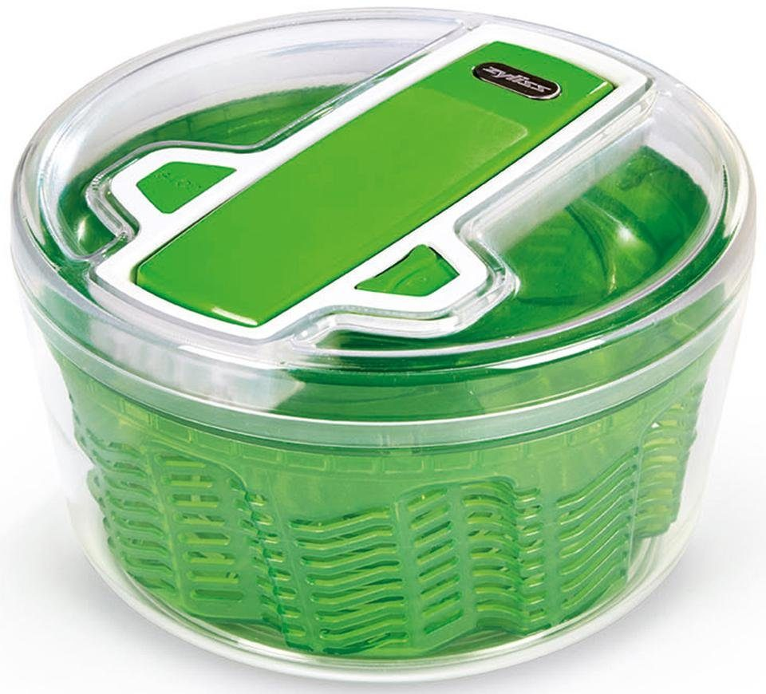
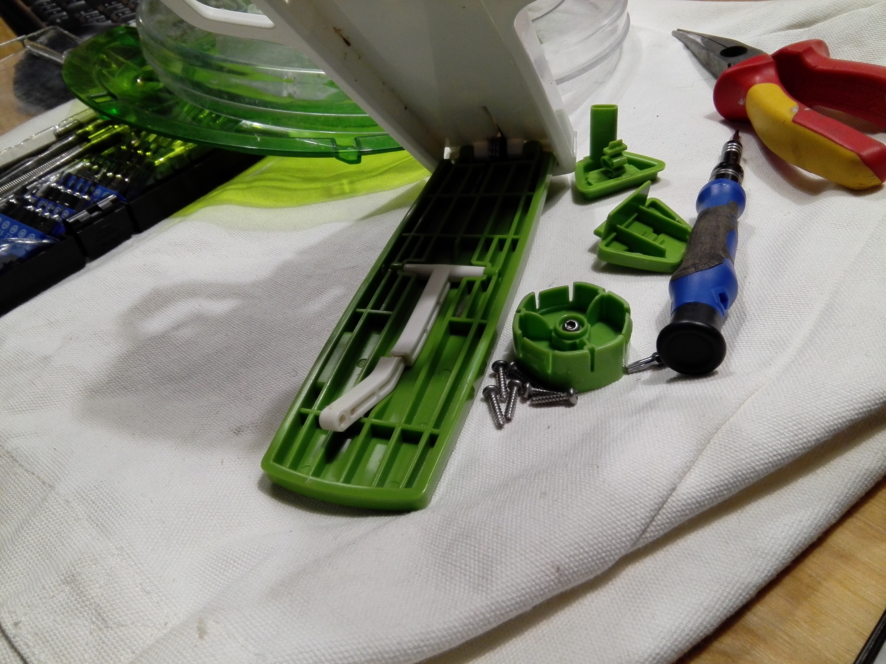
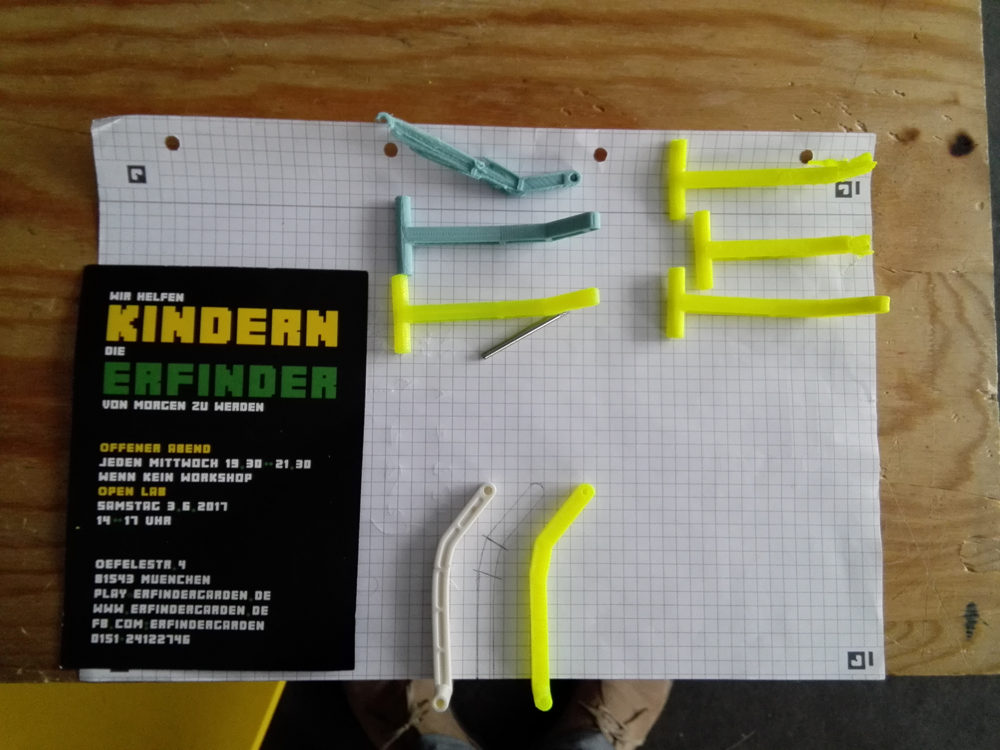
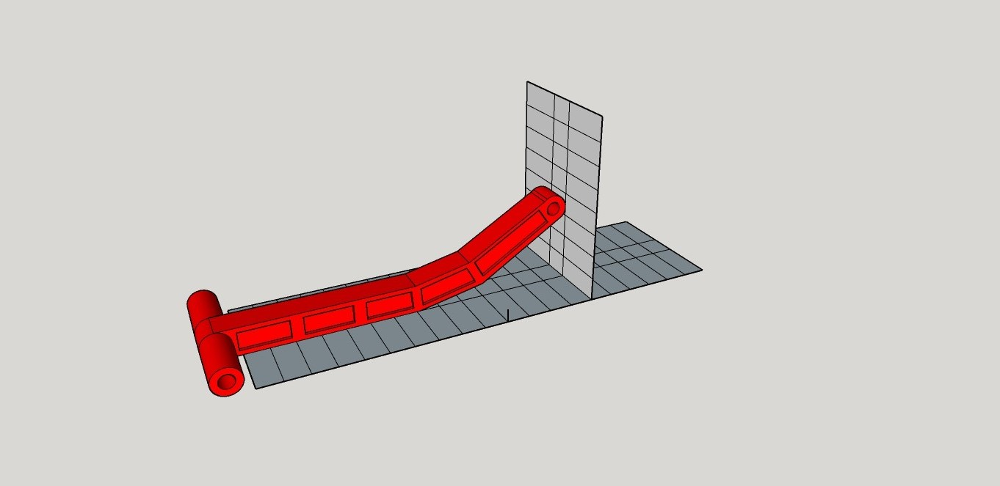
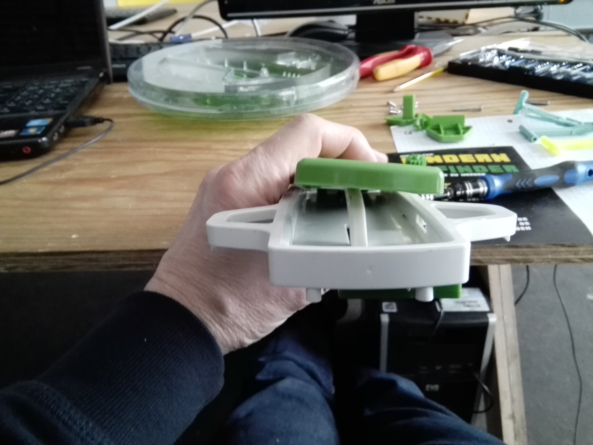
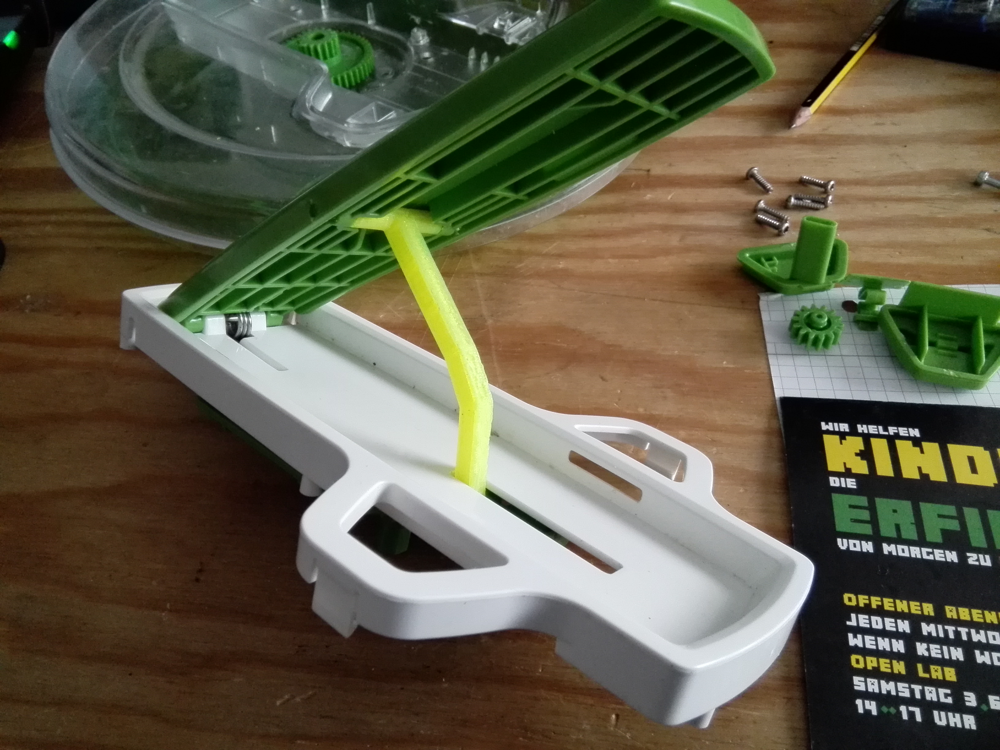

# Zyliss_Swift_Dry_Ersatzteil

26 cm Durchmesser

Ein Hebel im Mechanismus der Salatschleuder ist abgebrochen. Zwar etwas fragil für den 3D-Druck, aber auf jeden Fall einen Versuch wert. Zyliss gibt übrigens 5 Jahre Garantie auf seine Produkte.

Anscheinend passiert das öfters bei dieser Schleuder. Hier eine Bewertung bei Amazon:

Der im Original weiße Hebel ist gebrochen.

Um den defekten Hebel ausbauen zu können mussten die beiden Metallachsen ausgdrückt werden. Um die längere Achse auszudrücken musste ein 3mm Loch in den grünen Hebel gebohrt werden.

Um ihn besser nachbauen zu können, habe ich ihn auf ein kariertes Blatt gelegt und nachgezeichnet. Am Raster konnten gut die Maß und die Biegungen abgenommen werden.

In **SketchUp** habe ich dann ebenfalls das Raster als Grundlage gezeichnet und mich bei der Konstruktion danach gerichtet. Ein **SketchUp-Kurs** kann im [erfindergarden](http://www.erfindergarden.de) bei mir gebucht werden.

Eine weitere Möglichkeit wäre es gewesen, das Bauteil auf einem karierten Block zu fotografieren, in SketchUp zu importieren und dann diese Zeichnung zu skalieren: [Tutorial](https://www.youtube.com/watch?v=T4r6nGIsmAc "Tutorial")

Wärend das Ersatzteil gedruckt wurde, habe ich das Original geklebt. War eigentlich auch schon sehr stabil. Als ich das geklebte Ersatzteil montiert habe, musste ich aber feststellen, dass es nicht richtig passt. Die Biegung des Bügels war zu steil. Der Verschlussmechanismus der Schleuder lies sich nur durch Verbiegen des Hebels einrasten. Die Klebung war gerade, also muss es sich um einen **Konstruktionsfehler** handeln. So etwas kann ich mir zwar nicht vorstellen, aber erklären kann ich es mir auch nicht. Das könnte aber auch der Grund für das Brechen sein.

Mein erstes nachgedrucktes Bauteil war nicht ganz passend.

Ich musste die Maße etwas anpassen. Beim zweiten Versuch war es exakt wie das Original ... jedoch mit dem Problem das ebenfall der Verschlussmechanismus nur mit Gewalt zu schliessen war. 

Ich habe dann den ersten Druck, der ja nicht genau dem Original entsprach, mit der Heißluftpistole erwärmt und ihn um 5 mm nach unten gebogen. Jetzt schnappt der Verschlussmechanismus ohne Gewalt ein und der grüne Hebel verbigt sich nur noch minimal. Problem gelöst.

Die **SketchUp-Datei** und die **STL-Datei** wurden noch angepasst , so dass ein Erhitzen und Verbiegen nicht mehr notwendig sind.

Viel Spaß und Erfolg beim Nachbauen.  

